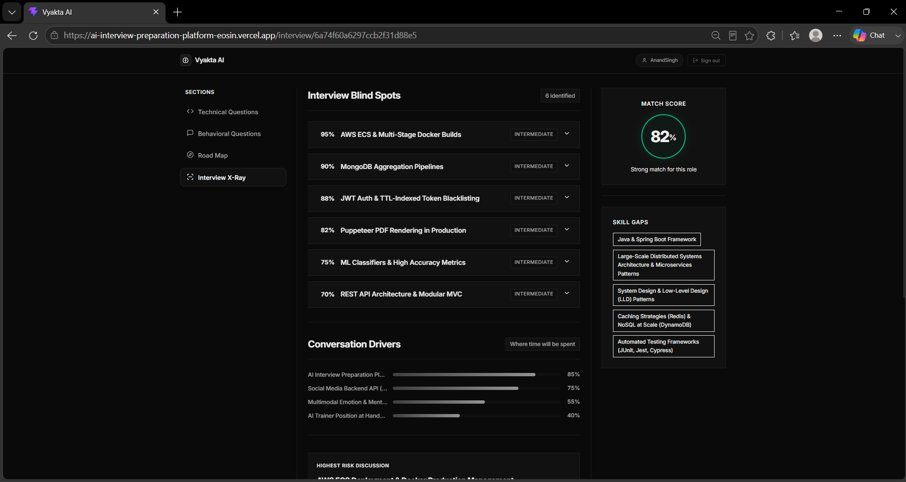
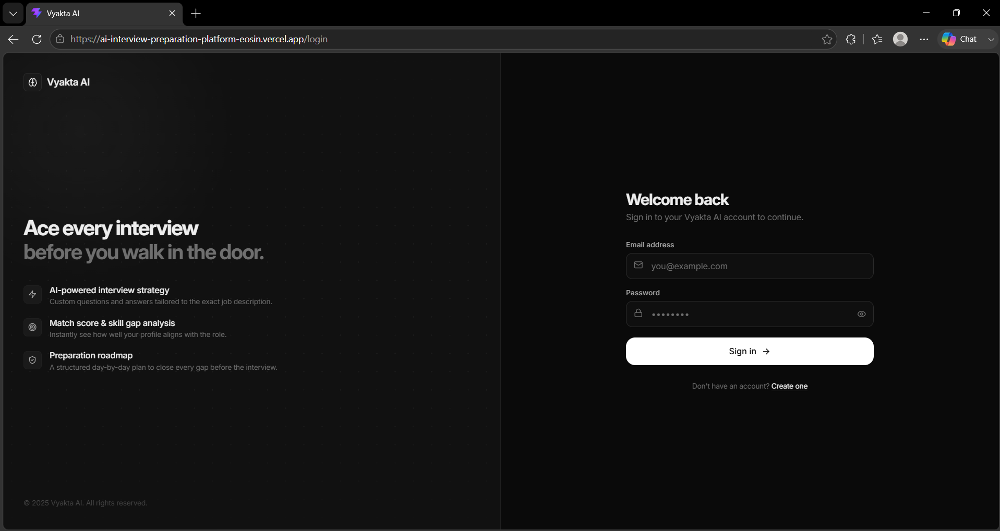
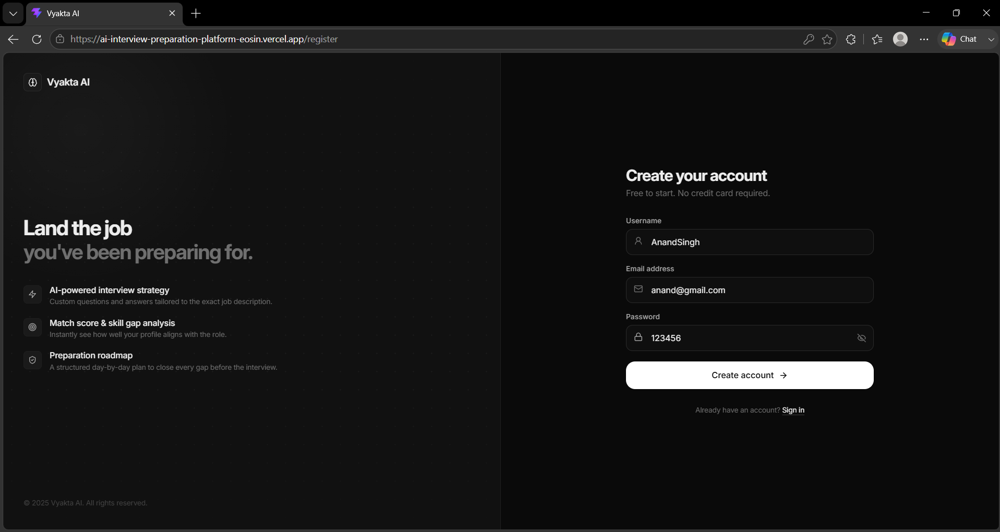
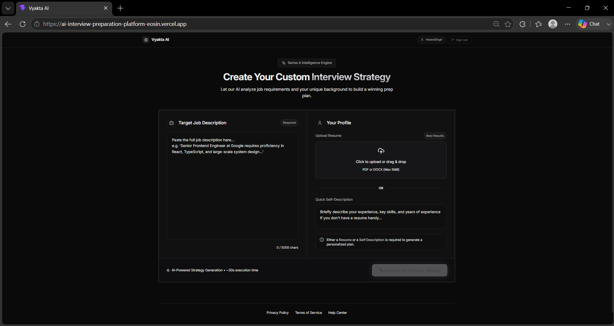
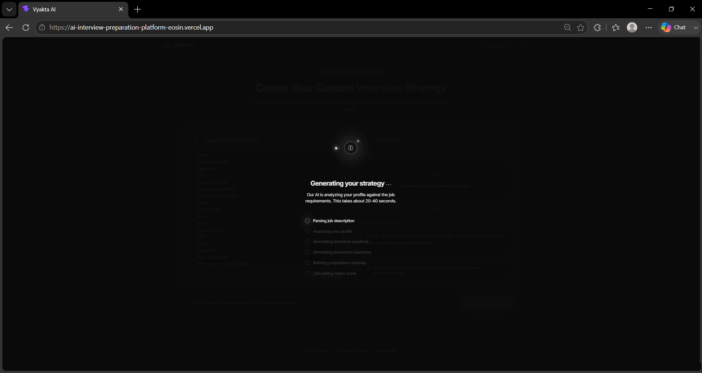
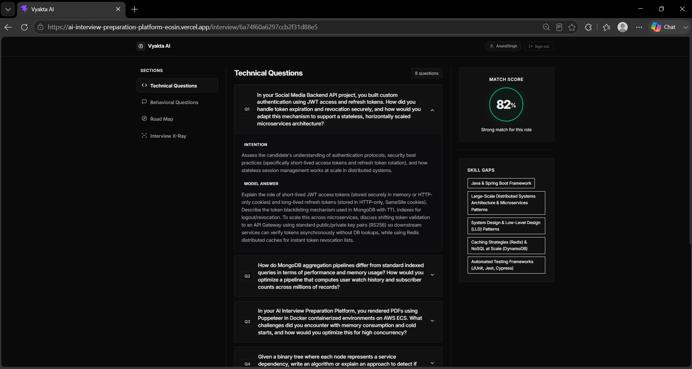
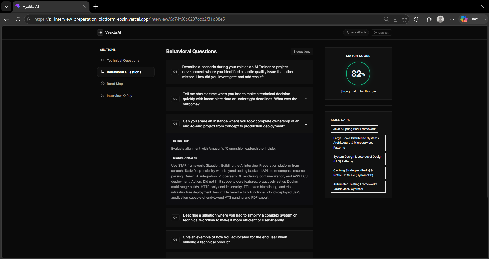
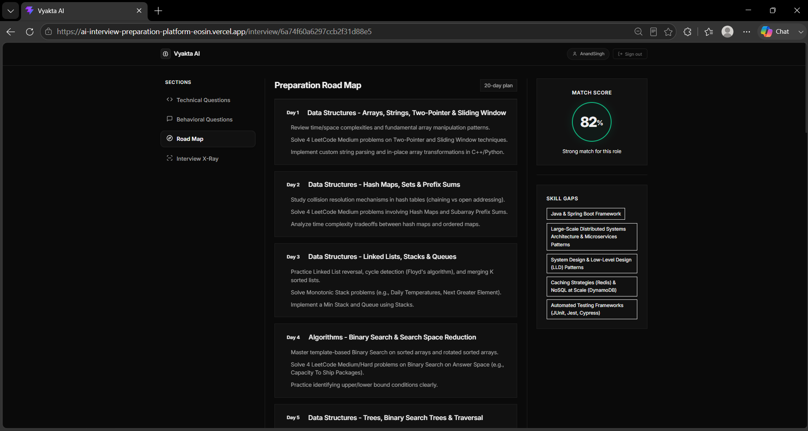
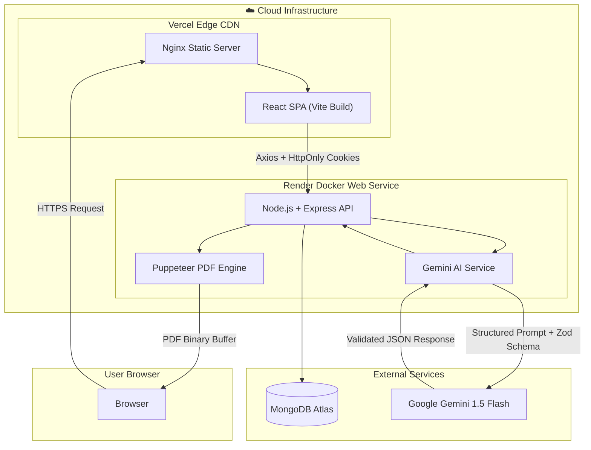

<div align="center">

<h1>
  
  &nbsp;Vyakta AI
</h1>

**AI-powered interview intelligence platform — from resume to interview-ready in minutes.**

[](https://ai-interview-preparation-platform-eosin.vercel.app)
[](https://ai-interview-preparation-platform-xsss.onrender.com)
[](https://github.com/Aditya-is-op200/AI-Interview-Preparation-Platform)

---

[](https://react.dev/)
[](https://vitejs.dev/)
[](https://nodejs.org/)
[](https://expressjs.com/)
[](https://www.mongodb.com/)
[](https://ai.google.dev/)
[](https://www.docker.com/)
[](https://pptr.dev/)
[](https://jwt.io/)
[](https://sass-lang.com/)
[](LICENSE)

---



*Interview X-Ray — AI Hiring Manager simulation that finds blind spots in your resume with evidence and probability scoring*

</div>

---

## 📌 Overview

**Vyakta AI** is a production-grade, full-stack AI platform that transforms interview preparation. Candidates upload their resume and paste a job description — Vyakta's AI engine instantly generates tailored technical questions, STAR behavioral scenarios, a 20-day preparation roadmap, and a detailed ATS PDF strategy report.

The platform's flagship feature — **Interview X-Ray** — simulates a Senior Engineering Hiring Manager reviewing your resume, identifying every blind spot with direct evidence quotes and follow-up probability scores.

> **Try it live** → [ai-interview-preparation-platform-eosin.vercel.app](https://ai-interview-preparation-platform-eosin.vercel.app)

---

## 🎬 Demo Video

> **Full platform walkthrough** — login through Interview X-Ray results in under 3 minutes.

https://github.com/Aditya-is-op200/AI-Interview-Preparation-Platform/releases/download/v1.0.0/AI-Interview-Preparation-Platform-DEMO_Video.mp4

> *Can't see the video? [Download it directly from the v1.0.0 Release](https://github.com/Aditya-is-op200/AI-Interview-Preparation-Platform/releases/tag/v1.0.0).*

---

## ✨ Features

| Feature | Description |
|---|---|
| 🔐 **Auth & Security** | JWT in HttpOnly cookies, bcrypt password hashing, token blacklisting with MongoDB TTL indexes, protected routes on frontend and backend |
| ⚡ **AI Strategy Engine** | Multi-input ingestion (resume PDF + job description), ATS match score 0–100%, skill gap severity classification, 8 targeted technical Q&As, STAR behavioral answers, 20-day roadmap |
| 🔬 **Interview X-Ray** | 5-pass AI pipeline simulating a hiring manager — finds blind spots with exact resume evidence, 1–100% follow-up probability, conversation drivers, risk analysis, and surprise question predictions |
| 📄 **ATS PDF Export** | Server-side Puppeteer headless Chromium PDF rendering with ATS-optimized formatting, downloadable directly from the dashboard |

---

## 🖼️ Screenshots

### 🔐 Authentication

<div align="center">

| Login | Register |
|---|---|
|  |  |

</div>

---

### 🏠 Dashboard

<div align="center">

| Empty Dashboard | AI Generation in Progress |
|---|---|
|  |  |

</div>

---

### 🎯 Interview Strategy

<div align="center">

| Technical Questions | Behavioral Questions |
|---|---|
|  |  |

</div>

<div align="center">

#### 🗓️ 20-Day Preparation Roadmap


</div>

---

### 🔬 Interview X-Ray *(Flagship Feature)*

<div align="center">


*AI hiring manager analysis — blind spots, probability scores, conversation drivers, risk & surprise question predictions*

</div>

---

## 🏗️ Architecture



---

## 🔬 How Interview X-Ray Works

Interview X-Ray is the platform's most sophisticated feature — it simulates how a **Senior Engineering Hiring Manager** actually reviews a resume during interview prep.

```
Pass 1: Technology Extraction
      → Identify every technology, tool, and framework claimed in the resume

Pass 2: Claim Extraction
      → Surface specific measurable claims (e.g. "reduced latency by 40%")

Pass 3: Expectation Mapping
      → Map each claim to what an interviewer expects the candidate to explain in depth

Pass 4: Gap Identification
      → Find mismatches between claims and expected technical depth

Pass 5: Probability Ranking
      → Score each blind spot with 1–100% follow-up probability
         + direct quote evidence from the resume
         + "why it matters" mentor advice
         + revision checklist for fixing the gap
```

**Additional outputs:**
- 📊 **Conversation Drivers** — bar chart data showing which topics dominate the interview
- 🚨 **Highest Risk Blind Spot** — the single most dangerous gap to walk in unprepared with
- ✅ **Safest Discussion** — the strongest resume section to expand on
- 😮 **Surprise Question Prediction** — the unexpected question most likely to catch you off guard

---

## 🛠️ Tech Stack

| Layer | Technology | Purpose |
|:---|:---|:---|
| **Frontend** | React.js (v18), React Router (v7) | SPA routing & view rendering |
| | Vite (v6) | Build tool & HMR dev server |
| | SCSS (Sass), Tailwind CSS | Modular design system & utility classes |
| | Axios | HTTP client with CORS credentials |
| **Backend** | Node.js (v20), Express.js (v5) | RESTful API server & route handlers |
| | MongoDB Atlas, Mongoose | Cloud document database & schema validation |
| | Multer | In-memory multipart resume file upload |
| | Puppeteer | Headless Chromium for HTML-to-PDF rendering |
| | `pdf-parse` | Server-side PDF text extraction |
| **AI Engine** | Google Gemini 1.5 Flash (`@google/genai`) | Natural language analysis & structured JSON output |
| | Zod + `zod-to-json-schema` | Strict type enforcement on every AI response |
| **Security** | JWT (`jsonwebtoken`), `bcryptjs`, `cookie-parser` | Hashed passwords, signed tokens, HttpOnly cookies |
| **DevOps** | Docker, Docker Compose | Multi-container local & production deployment |
| | Nginx (Alpine) | Static file serving & SPA routing in container |
| | Vercel | Frontend CDN edge deployment |
| | Render | Backend Docker Web Service hosting |

---

## 📁 Project Structure

```text
AI-Interview-Preparation-Platform/
├── Backend/
│   ├── src/
│   │   ├── config/              # MongoDB connection setup
│   │   ├── controllers/         # Auth & Interview request handlers
│   │   ├── middlewares/         # JWT auth & Multer upload middleware
│   │   ├── models/              # Mongoose models (User, InterviewReport, Blacklist)
│   │   ├── routes/              # Express API route definitions
│   │   └── services/            # Gemini AI service & Puppeteer PDF generator
│   ├── app.js                   # Express app init, CORS, middleware chain
│   ├── server.js                # Server entrypoint & DB connection bootstrap
│   ├── Dockerfile               # Debian Node + Chromium dependencies for Puppeteer
│   ├── .dockerignore
│   └── package.json
├── Frontend/
│   ├── src/
│   │   ├── components/          # Shared: Navbar, Icons, SkeletonLoader
│   │   ├── features/
│   │   │   ├── auth/            # Login, Register, Protected route, auth context & API
│   │   │   └── interview/       # Home, Interview, X-Ray pages, hooks, styles & API
│   │   ├── style/               # Global SCSS design tokens, base reset
│   │   ├── App.jsx              # Root wrapper & provider tree
│   │   ├── app.routes.jsx       # React Router browser routing config
│   │   └── main.jsx             # DOM mount point
│   ├── Dockerfile               # Multi-stage: Vite build → Nginx Alpine
│   ├── nginx.conf               # SPA routing & API reverse proxy config
│   ├── index.html
│   ├── vite.config.js
│   └── package.json
├── docs/
│   ├── END_TO_END_DEPLOYMENT_GUIDE.md
│   ├── DOCKER_DEEP_DIVE.md
│   ├── PHASE2_ENV_DEEP_DIVE.md
│   └── INTERVIEW_XRAY_SPECIFICATION.md
├── assets/                      # Platform showcase screenshots & demo video
├── docker-compose.yml           # Multi-container orchestration (dev)
└── README.md
```

---

## 🔌 API Reference

### Authentication — `/api/auth`

| Method | Endpoint | Access | Description |
|:---|:---|:---|:---|
| `POST` | `/api/auth/register` | Public | Register user, set HttpOnly JWT cookie |
| `POST` | `/api/auth/login` | Public | Authenticate credentials, set JWT cookie |
| `GET` | `/api/auth/logout` | Public | Blacklist active JWT, clear cookie |
| `GET` | `/api/auth/get-me` | 🔒 Private | Return current authenticated user profile |

### Interview — `/api/interview`

| Method | Endpoint | Access | Description |
|:---|:---|:---|:---|
| `POST` | `/api/interview/` | 🔒 Private | Generate AI interview plan from resume PDF + job description |
| `GET` | `/api/interview/` | 🔒 Private | Fetch all past interview strategy summaries for logged-in user |
| `GET` | `/api/interview/report/:interviewId` | 🔒 Private | Fetch full interview report by ID |
| `POST` | `/api/interview/resume/pdf/:interviewReportId` | 🔒 Private | Render & download ATS-optimized PDF resume |
| `POST` | `/api/interview/:interviewReportId/xray` | 🔒 Private | Run Interview X-Ray analysis on an existing report |

---

## ⚙️ Environment Variables

### Backend (`Backend/.env`)

```env
PORT=3000
NODE_ENV=development
MONGO_URI=mongodb+srv://<username>:<password>@cluster.mongodb.net/InterviewAI?retryWrites=true&w=majority
JWT_SECRET=your_jwt_super_secret_key_here
GOOGLE_GENAI_API_KEY=your_google_gemini_api_key_here
CLIENT_URL=http://localhost:5173
```

### Frontend (`Frontend/.env`)

```env
VITE_API_URL=http://localhost:3000
```

> **Production note**: Set `NODE_ENV=production`, `CLIENT_URL=https://your-app.vercel.app`, and `VITE_API_URL=https://your-backend.onrender.com` in your deployment dashboards.

---

## 🚀 Getting Started

### Prerequisites

- **Node.js** v18.x or higher
- **MongoDB Atlas** cluster (or local MongoDB)
- **Google Gemini API Key** from [Google AI Studio](https://aistudio.google.com/)
- **Docker Desktop** (for the Docker path)

---

### ⭐ Path A — Docker (Recommended)

The fastest way to run the full stack with a single command.

```bash
# 1. Clone the repository
git clone https://github.com/Aditya-is-op200/AI-Interview-Preparation-Platform.git
cd AI-Interview-Preparation-Platform

# 2. Create Backend environment file
cp Backend/.env.example Backend/.env
# → Fill in MONGO_URI, JWT_SECRET, GOOGLE_GENAI_API_KEY

# 3. Create Frontend environment file
cp Frontend/.env.example Frontend/.env
# → VITE_API_URL=http://localhost:3000

# 4. Build and start all containers
docker compose up --build
```

| Service | URL |
|---|---|
| Frontend | http://localhost:5173 |
| Backend API | http://localhost:3000 |

```bash
# Stop containers
docker compose down
```

---

### Path B — Manual (Development)

**1. Clone the repository**

```bash
git clone https://github.com/Aditya-is-op200/AI-Interview-Preparation-Platform.git
cd AI-Interview-Preparation-Platform
```

**2. Backend setup**

```bash
cd Backend
npm install
```

Create `Backend/.env` using the [Environment Variables](#%EF%B8%8F-environment-variables) section above.

```bash
npm run dev
# Backend running at http://localhost:3000
```

**3. Frontend setup** *(in a new terminal)*

```bash
cd Frontend
npm install
```

Create `Frontend/.env`:
```env
VITE_API_URL=http://localhost:3000
```

```bash
npm run dev
# Frontend running at http://localhost:5173
```

---

## ☁️ Deployment

| Layer | Platform | Method |
|---|---|---|
| **Frontend** | [Vercel](https://vercel.com) | Auto-deploy from GitHub, root dir: `Frontend/` |
| **Backend** | [Render](https://render.com) | Docker Web Service, Dockerfile: `Backend/Dockerfile` |
| **Database** | [MongoDB Atlas](https://www.mongodb.com/atlas) | Shared M0 cluster (free tier) |

### Live Deployments

| | URL |
|---|---|
| 🌐 **Frontend** | https://ai-interview-preparation-platform-eosin.vercel.app |
| ⚙️ **Backend API** | https://ai-interview-preparation-platform-xsss.onrender.com |

### Key Production Config

```
Render → Environment Variables:
  NODE_ENV=production
  CLIENT_URL=https://ai-interview-preparation-platform-eosin.vercel.app
  PORT=3000
  MONGO_URI=<your_atlas_connection_string>
  JWT_SECRET=<your_secret>
  GOOGLE_GENAI_API_KEY=<your_key>

Vercel → Environment Variables:
  VITE_API_URL=https://ai-interview-preparation-platform-xsss.onrender.com
```

---

## ⚡ Engineering Highlights

- **Cross-Domain Cookie Security**: Solved cross-origin JWT authentication between Vercel and Render by configuring `httpOnly: true`, `secure: true`, and `sameSite: "none"` on response cookies, with dynamic production CORS whitelisting to prevent `"*"` wildcard with credentials.

- **Headless Puppeteer in Docker**: Resolved headless Chromium crashes in Node Docker containers by installing Linux system dependencies (`libnss3`, `libgbm1`, `libglib2.0-0`) in the Dockerfile and configuring Puppeteer with `--no-sandbox` and `--disable-dev-shm-usage` launch flags.

- **Multi-Stage Docker Builds**: Reduced the Frontend Docker image from ~500MB (raw Node) to **<15MB** using a 2-stage build — Stage 1 compiles the React/Vite bundle; Stage 2 copies only `/dist` into Nginx Alpine for production serving.

- **Zod-Enforced AI Responses**: Eliminated hallucinated or malformed AI outputs by converting Zod schemas to JSON Schema and passing them as `responseSchema` to the Gemini API, guaranteeing every field, type, and enum value matches the frontend contract before it hits the database.

---

## 🗺️ Future Roadmap

- [ ] **Voice Mock Interviews** — Real-time audio question delivery with speech-to-text response scoring
- [ ] **Conversational AI Interviewer** — Follow-up questions based on live candidate responses
- [ ] **Coding Sandbox** — In-browser code editor with test-case execution for technical rounds
- [ ] **Company-Specific Prep Kits** — Tailored templates for FAANG/MAMAA companies
- [ ] **OAuth Integration** — Google and GitHub social logins
- [ ] **Email Notifications** — Automated study reminders and roadmap progress tracking

---

## 🤝 Contributing

Contributions are welcome!

1. **Fork the repository**

2. **Create a feature branch**
```bash
git checkout -b feature/new-feature
```

3. **Commit changes**
```bash
git commit -m "Add amazing feature"
```

4. **Push changes**
```bash
git push origin feature/new-feature
```

5. **Open a Pull Request**

---

## 👤 Author

**Aditya Singh**

[](https://github.com/Aditya-is-op200)
[](https://www.linkedin.com/in/aditya-singh-2512662ba/)
[](https://leetcode.com/u/Aditya_Singh_Lko/)
[](mailto:adityaanandsingh2004codes@gmail.com)

---

## 📄 License

This project is licensed under the **MIT License** — see the [LICENSE](LICENSE) file for details.

---

<div align="center">

**⭐ If Vyakta AI helped you prepare for interviews, give it a star!**

Made with ❤️ by [Aditya Singh](https://github.com/Aditya-is-op200)

</div>
