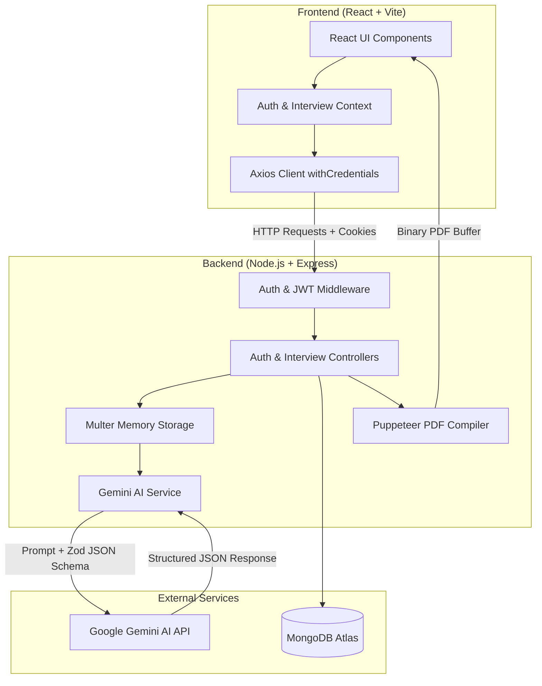
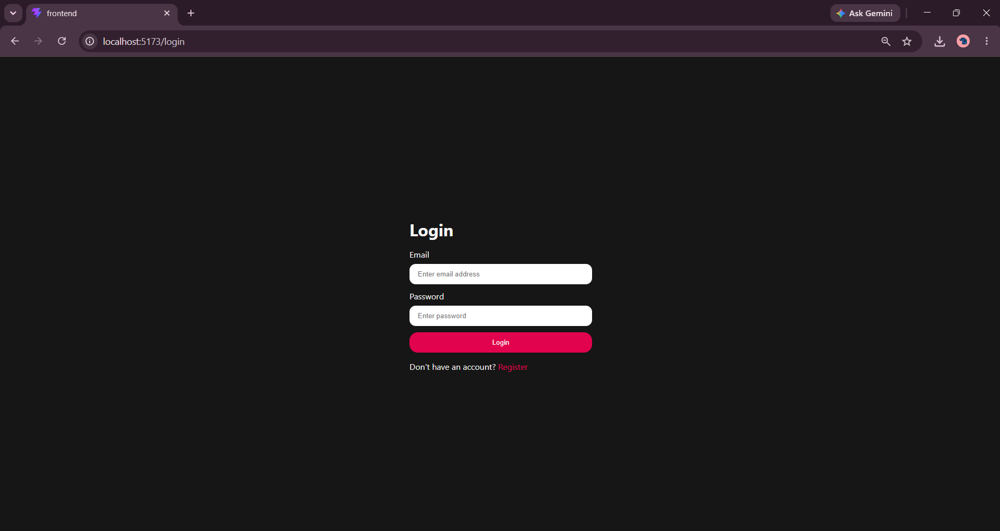
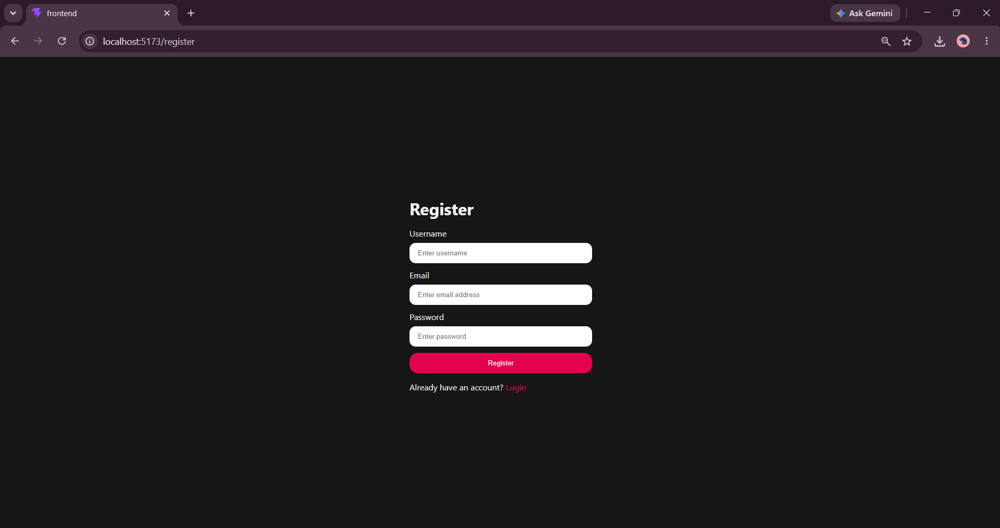
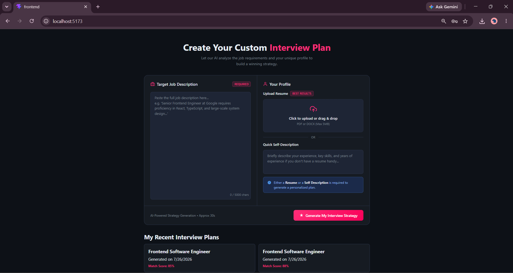
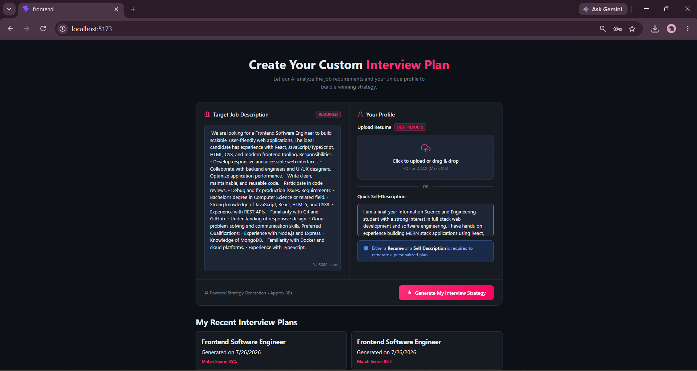
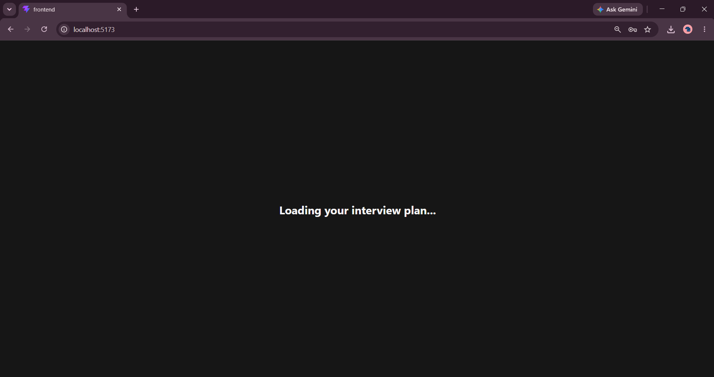
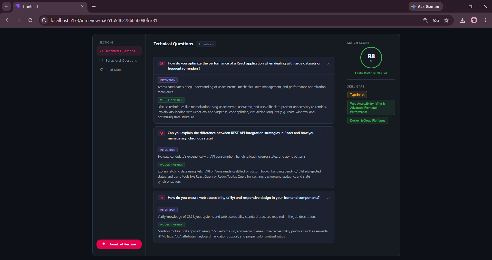
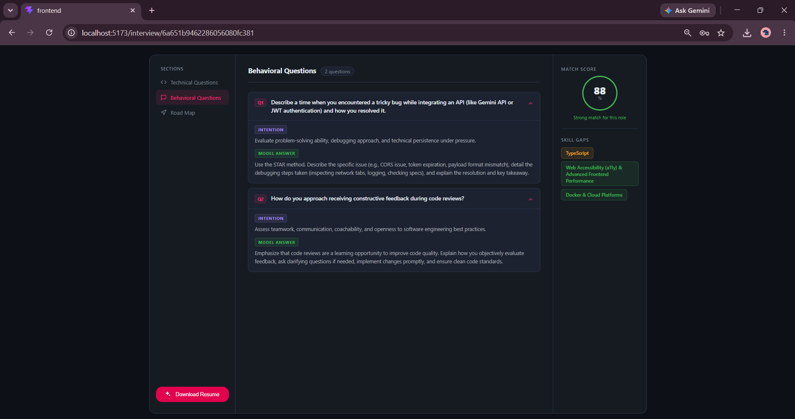
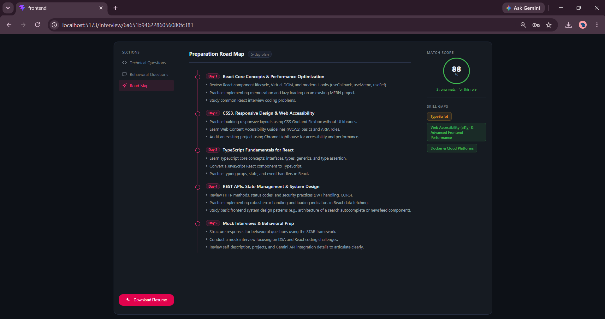
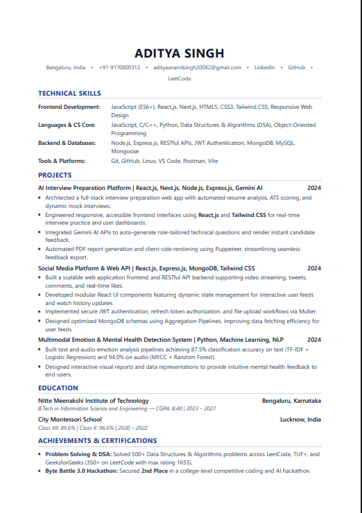

<div align="center">

# 🚀 AI Interview Preparation Platform

A full-stack, AI-powered platform that analyzes candidate resumes against job descriptions, identifies skill gaps, generates targeted technical and behavioral interview questions, builds personalized preparation roadmaps, and exports ATS-friendly PDF reports.

[](https://react.dev/)
[](https://nodejs.org/)
[](https://expressjs.com/)
[](https://www.mongodb.com/)
[](https://ai.google.dev/)
[](https://jwt.io/)
[](https://vitejs.dev/)
[](https://sass-lang.com/)
[](LICENSE)

</div>

---

## 📌 Overview

Preparing for technical interviews requires aligning your experience with specific job descriptions. The **AI Interview Preparation Platform** automates this process by parsing candidate resumes (PDF/DOCX) or self-descriptions, matching them against target job requirements using **Google Gemini AI**, and outputting structured interview strategies alongside downloadable ATS-formatted PDFs.

---

## ✨ Features

### 🔐 Authentication & Security
- **User Registration & Login**: Secure account creation and credential authentication.
- **HTTP-Only Cookie Management**: Prevents XSS-based token theft by storing JWTs in secure cookies.
- **Token Blacklisting**: Revokes active JWTs upon logout using MongoDB TTL blacklist indexes.
- **Protected Routes**: Restricts authenticated application areas on both frontend and API routes.

### ⚡ AI Strategy Generator
- **Multi-Input Ingestion**: Accept job descriptions with either a PDF/DOCX resume upload or a quick self-description.
- **Resume Parsing & Extraction**: Server-side binary PDF text extraction via `pdf-parse`.
- **Match Score Calculation**: Evaluates candidate fit on a 0–100% scale based on job criteria.
- **Skill Gap Detection**: Categorizes missing candidate competencies with severity ratings (`Low`, `Medium`, `High`).

### 🎯 Structured Preparation & Q&A
- **Technical Questions**: Generates domain-specific questions, interviewer intention, and model answers.
- **Behavioral Questions**: Prepares STAR-framework scenarios tailored to the role.
- **Day-by-Day Roadmap**: Formulates a daily preparation schedule with action items.

### 📄 ATS Resume & PDF Export
- **Dynamic PDF Generation**: Uses headless Puppeteer to compile tailored HTML resumes into ATS-optimized PDF downloads.

---

## 🏗️ Architecture



---

## 🔄 Workflow

```
Job Description + Resume / Self-Description
               │
               ▼
   Backend Document Extraction (pdf-parse)
               │
               ▼
   Gemini AI Analysis (Zod Schema Validation)
               │
   ┌───────────┴─────────────────────────┐
   ▼                                     ▼
Match Score & Skill Gaps       Technical & Behavioral Q&A
   │                                     │
   └───────────┬─────────────────────────┘
               ▼
   Day-by-Day Preparation Roadmap
               │
               ▼
   ATS HTML Compilation & Puppeteer PDF Generation
```

---

## 🛠️ Tech Stack

| Layer | Technology | Usage |
| :--- | :--- | :--- |
| **Frontend** | React.js (v18), React Router (v7) | Single-page app routing & view rendering |
| | SCSS (Sass) | Modular custom styling system |
| | Axios | HTTP client configured with CORS credentials |
| | Vite | Build tool & HMR development server |
| **Backend** | Node.js, Express.js (v5) | RESTful API server & route handlers |
| | MongoDB Atlas & Mongoose | Document database & schema validation |
| | Multer | In-memory multipart file upload handling |
| | Puppeteer | Headless Chrome browser for HTML-to-PDF rendering |
| | `pdf-parse` | Node.js buffer text extraction from PDF files |
| **AI Engine** | Google Gemini API (`gemini-flash-latest`) | Natural language parsing & structured JSON output |
| | Zod & `toJSONSchema` | Strict type validation for AI response enforcement |
| **Security** | JWT (`jsonwebtoken`), `bcryptjs`, `cookie-parser` | Hashed passwords, signed tokens, HTTP-only cookies |

---

## 📁 Project Structure

```text
AI-Interview-Preparation-Platform/
├── Backend/
│   ├── src/
│   │   ├── config/          # MongoDB database connection setup
│   │   ├── controllers/     # Auth & Interview request handlers
│   │   ├── middlewares/     # JWT authentication & Multer upload middleware
│   │   ├── models/          # Mongoose models (User, InterviewReport, Blacklist)
│   │   ├── routes/          # Express API route definitions
│   │   └── services/        # Gemini AI service & Puppeteer PDF generator
│   ├── app.js               # Express application initialization & middleware
│   ├── server.js            # Server entrypoint & DB connection wrapper
│   └── package.json
├── Frontend/
│   ├── src/
│   │   ├── features/
│   │   │   ├── auth/        # Auth pages, context, hooks, and API services
│   │   │   └── interview/   # Interview pages, context, hooks, styles, and API services
│   │   ├── style/           # Global SCSS design tokens and base reset
│   │   ├── App.jsx          # Root application wrapper & provider tree
│   │   ├── app.routes.jsx   # React Router browser routing configuration
│   │   └── main.jsx         # DOM mount point
│   ├── index.html
│   ├── vite.config.js
│   └── package.json
└── assets/                  # Platform preview screenshots
```

---

## 🖼️ Screenshots

### Authentication

<div align="center">

#### Login


#### Register


</div>

---

### Dashboard & Creation

<div align="center">

#### Dashboard Home


#### Create Interview Plan


#### AI Strategy Processing


</div>

---

### Generated Interview Strategy

<div align="center">

#### Technical Questions


#### Behavioral Questions


#### Preparation Roadmap


</div>

---

### ATS PDF Export

<div align="center">

#### ATS Report - Page 1


#### ATS Report - Page 2


</div>

---

## 🔌 API Endpoints

### Authentication Routes (`/api/auth`)

| Method | Endpoint | Access | Description |
| :--- | :--- | :--- | :--- |
| `POST` | `/api/auth/register` | Public | Registers user and sets HTTP-only JWT cookie |
| `POST` | `/api/auth/login` | Public | Authenticates credentials and sets JWT cookie |
| `GET` | `/api/auth/logout` | Public | Blacklists active JWT token and clears cookie |
| `GET` | `/api/auth/get-me` | Private | Returns current authenticated user profile |

### Interview Routes (`/api/interview`)

| Method | Endpoint | Access | Description |
| :--- | :--- | :--- | :--- |
| `POST` | `/api/interview/` | Private | Generates AI interview plan from file/description |
| `GET` | `/api/interview/` | Private | Fetches all past interview strategy summaries |
| `GET` | `/api/interview/report/:interviewId` | Private | Fetches full interview report by unique ID |
| `POST` | `/api/interview/resume/pdf/:interviewReportId` | Private | Renders and downloads ATS-styled PDF resume |

---

## ⚙️ Environment Variables

### Backend (`Backend/.env`)

```env
PORT=3000
MONGO_URI=mongodb+srv://<username>:<password>@cluster.mongodb.net/InterviewAI?retryWrites=true&w=majority
JWT_SECRET=your_jwt_super_secret_key_here
GOOGLE_GENAI_API_KEY=your_google_gemini_api_key_here
```

### Frontend (`Frontend/.env`)

```env
VITE_API_URL=http://localhost:3000
```

---

## 🚀 Installation & Setup

### Prerequisites
- **Node.js**: v18.x or higher
- **MongoDB**: Active Atlas Cluster or local MongoDB instance
- **Google Gemini API Key**: Obtainable from [Google AI Studio](https://aistudio.google.com/)

### 1. Clone Repository

```bash
git clone https://github.com/Aditya-is-op200/AI-Interview-Preparation-Platform.git
cd AI-Interview-Preparation-Platform
```

### 2. Backend Setup

```bash
cd Backend
npm install
```

Create a `.env` file in the `Backend` directory using the variables specified in the [Environment Variables](#%EF%B8%8F-environment-variables) section.

Start the backend server:

```bash
npm run dev
```

### 3. Frontend Setup

In a new terminal window:

```bash
cd Frontend
npm install
```

Start the Vite development server:

```bash
npm run dev
```

Open `http://localhost:5173` in your browser.

---

## 🔮 Future Roadmap

- [ ] **Voice-Based Mock Interviews**: Real-time audio question delivery and speech-to-text response scoring.
- [ ] **Interactive AI Interviewer**: Conversational follow-up questions based on live responses.
- [ ] **Integrated Coding Sandbox**: In-browser code editor with test-case execution for technical rounds.
- [ ] **Company-Specific Kits**: Tailored interview templates for major tech companies (FAANG/MAMAA).
- [ ] **OAuth Integration**: Social logins via Google and GitHub.
- [ ] **Email Notifications**: Automated study reminders and roadmap progress tracking.
- [ ] **Dockerization & CI/CD**: Containerized deployment pipelines with GitHub Actions.

---

## 👤 Author

**Aditya Singh**

- **GitHub**: [@Aditya-is-op200](https://github.com/Aditya-is-op200)
- **LinkedIn**: [Aditya Singh](https://linkedin.com/in/adityasingh)
- **Email**: [adityaanandsingh2004codes@gmail.com](mailto:adityaanandsingh2004codes@gmail.com)

---

## 📄 License

This project is licensed under the MIT License.

Feel free to use, modify, and distribute this project in accordance with the terms of the license.

See the [LICENSE](LICENSE) file for more details.
